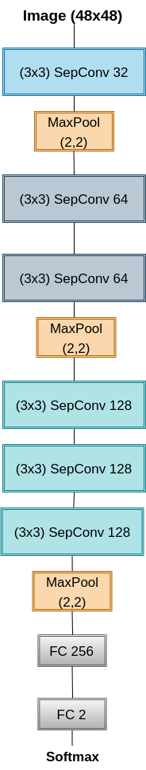

## Partie 1

La référence de code que j’ai utilisée

https://github.com/sayakpaul/Breast-Cancer-Detection-using-Deep-Learning 

En effet, j'ai testé la bibliothèque **Fastai** : 
https://dejanbatanjac.github.io/2019/03/15/ImageDataBunch.html 

**vision.data** contient la définition d'**ImageDataBunch** et **DataBunch** 

Ça n'a pas marché
*************************************************************************************

## Partie 2

La référence de code que j'ai utilisé 

https://pyimagesearch.com/2019/02/18/breast-cancer-classification-with-keras-and-deep-learning/  

Le modèle utilisé c'est **CancerNet** : https://bmcbioinformatics.biomedcentral.com/articles/10.1186/s12859-022-04783-y 
The optimizer that I tested : Adagrad, Adam 

**CancerNet** est un modèle de réseau neural convolutif (RNC) ou (convolutional neural network **CNN** en anglais) proposé pour la classification des images histologiques du cancer du sein.

**CancerNet** est un modèle d’apprentissage profond qui utilise plusieurs couches de convolution et de regroupement pour apprendre les caractéristiques des images d’entrée. L’architecture du modèle se compose de multiples couches convolutionnelles, suivies de couches de mise en commun max, puis de couches entièrement connectées. La dernière couche est une couche de softmax, qui produit la distribution de probabilité prévue sur les différentes classes de cancer.

**CancerNet** est un modèle a été conçu pour classer les images histologiques du cancer du sein en quatre classes différentes : tissu normal, lésions bénignes, carcinome in situ et carcinome invasif. Il a été formé sur un grand ensemble de données d’images du cancer du sein et atteint une grande précision dans la classification.

Il convient de noter qu’il peut y avoir plusieurs versions du modèle **CancerNet**, car les chercheurs en apprentissage profond apportent souvent des modifications aux architectures existantes pour améliorer leur rendement sur des tâches ou des ensembles de données précis.

## L'architecture de notre modèle 

(3x3) SepConv, 32
MaxPool (2,2)
(3x3) SepConv, 64
(3x3) SepConv, 64
MaxPool (2,2)
(3x3) SepConv, 128
(3x3) SepConv, 128
(3x3) SepConv, 128
MaxPool (2,2)
FC (256)
FC (2)
Softmax

## Schéma 

## SepConv  (Separable Convolution) 

* Plus efficace

* Nécessite moins de mémoire

* Nécessite moins de calculs

* Peut donner de meilleurs résultats dans certaines situations que la convolution normale

* On a utilisé un **padding = same** dans le code pour que la sortie des couches de convolutions soit de la même taille de l'entrée.

* Le **SeparableConv2D** sert à factoriser un filtre en deux plus petits.
Pour cela, des opérations de convolutions seront effectuées sur chaque channel (RGB) puis une autre convolution sera faite sur les conv RGB 
pour permettre de mélanger les canaux de sortie résultants (des conv RGB).

## Softmax  

* Problème de classification à classes multiples

* Les retours du modèle prédictif :

* La classe prévue (identifiée par un nombre par exemple).

* La liste des probabilités d’appartenance à chaque classe. 

* Le modèle retourne ensuite un vecteur de probabilité, c’est-à-dire un vecteur de nombres entre 0 et 1, dont la somme est 1.

## Precision

* Très précis pour les tumeurs bénignes (95%) mais beaucoup moins pour les tumeurs malignes (environ 70%).

* Cela peut s’expliquer par le fait que les tumeurs bénignes sont probablement plus semblables que les tumeurs malignes qui peuvent être de différents types donc plus compliqué à détecter parce que très spécifique selon le cas.

## MaxPooling  

* Il sélectionne l’élément maximum à partir de la carte d'activation (Activation map en anglais). 
La couche maximale résultant détient des caractéristiques importantes de la carte de fonctionnalités.

* C’est l’approche la plus courante car elle donne de meilleurs résultats.

* **ReLU** fixe toutes les valeurs négatives à zéro et toutes les autres valeurs restent constantes.

* On part sur le **2D** car on travaille sur les images qui ont donc seulement deux axes/ dimensions (x,y)  

